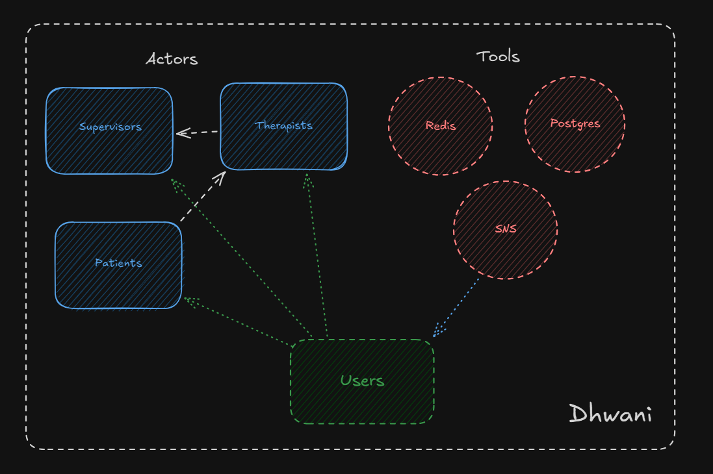

# **Application Architecture Documentation**

## **1. Overview**

This document outlines the technical architecture of the application, detailing the backend, frontend, database, messaging system, and other services used to power the system. The primary goal is to ensure an efficient and scalable system that can manage multiple users (patients, therapists, supervisors) and provide them with seamless access to the features of the application.

## **2. Technology Stack**

### **2.1 Frontend**

- **Next.js**

### **2.2 Backend**

- **Nest.js**

### **2.3 Database**

- **PostgreSQL**

### **2.4 Caching & Session Management**

- **Redis**

### **2.5 Messaging & Notifications**

- **AWS SNS (Simple Notification Service)**

## **3. Application Flow**

1. **Frontend (Next.js)**:

   - The user interacts with the frontend application, which communicates with the backend through REST or GraphQL API requests.
   - User authentication is handled using JWT tokens stored in cookies or local storage.

2. **Backend (Nest.js)**:

   - The backend processes API requests, interacts with the PostgreSQL database, performs business logic, and returns data to the frontend.
   - Nest.js handles user authentication and role-based access control to ensure each user type (patient, therapist, supervisor) has access to the correct resources.
   - **Redis** is utilized for caching data like session schedules or consultation progress for fast retrieval.

3. **Database (PostgreSQL)**:

   - Stores data for users, consultations, sessions, and other persistent information.
   - The database schema is normalized and designed to support various relationships (e.g., one-to-many relationships between patients and sessions).

4. **Notifications (AWS SNS)**:
   - AWS SNS is used to send notifications to users about upcoming sessions or important updates, ensuring timely communication across the system.
